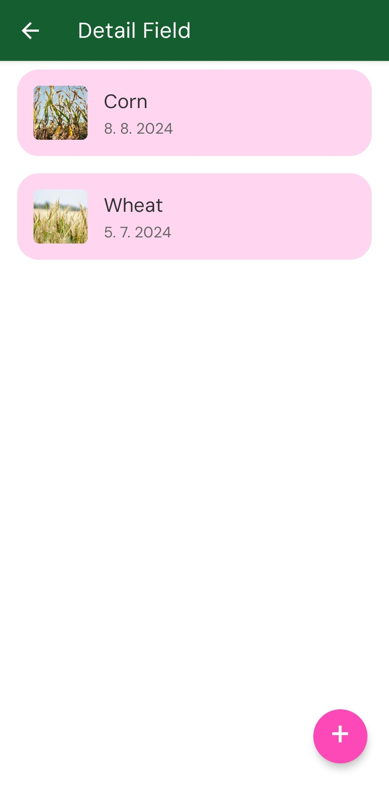
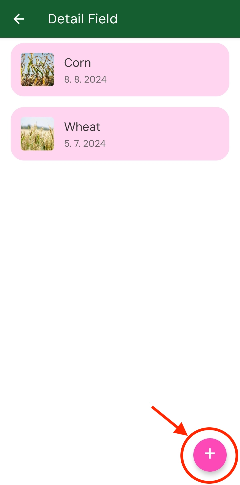
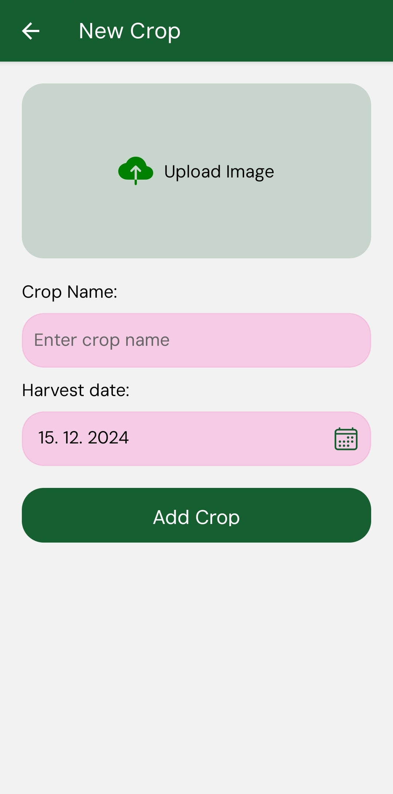
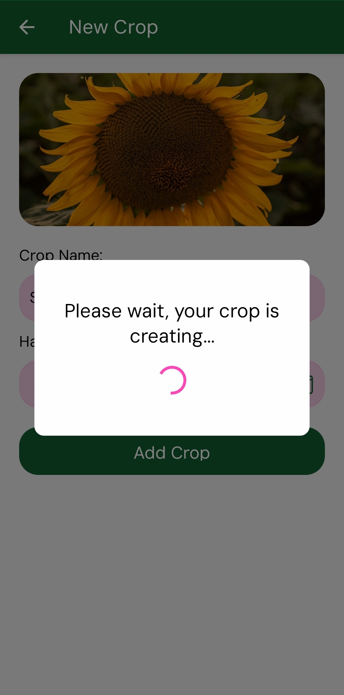
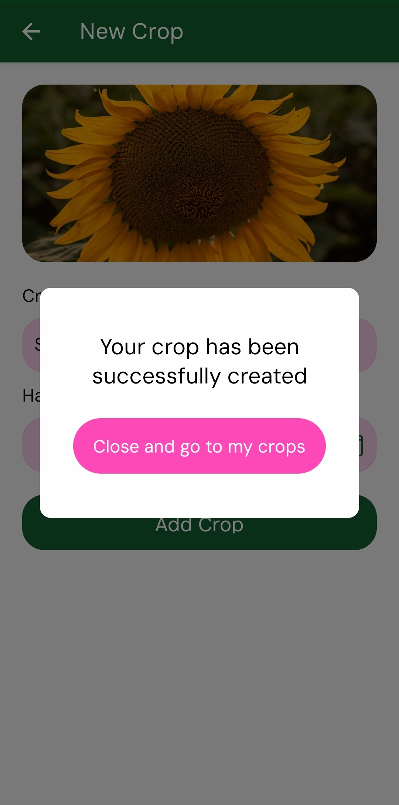
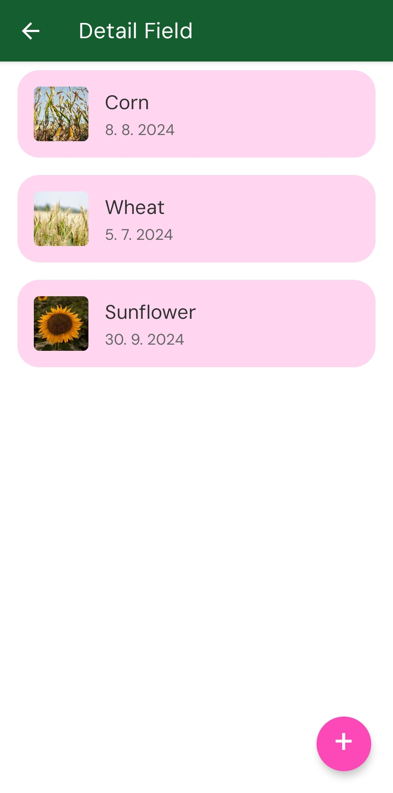

# Creating your first crop 🌾

After you selected the field you wish to mint your crop into you will be greeted with crops that are created for the field already (If any).

You can click on "+" button to add new field.

You will be prompted to enter crop details such as crop name and crop harwest time.

Once you click on create you will be greeted with loader. Please wait while your crop mints.

After the crop is created you can click on return to crops.

    
    

Clicking on certain crop will give you ability to generate crop proof of origin.

