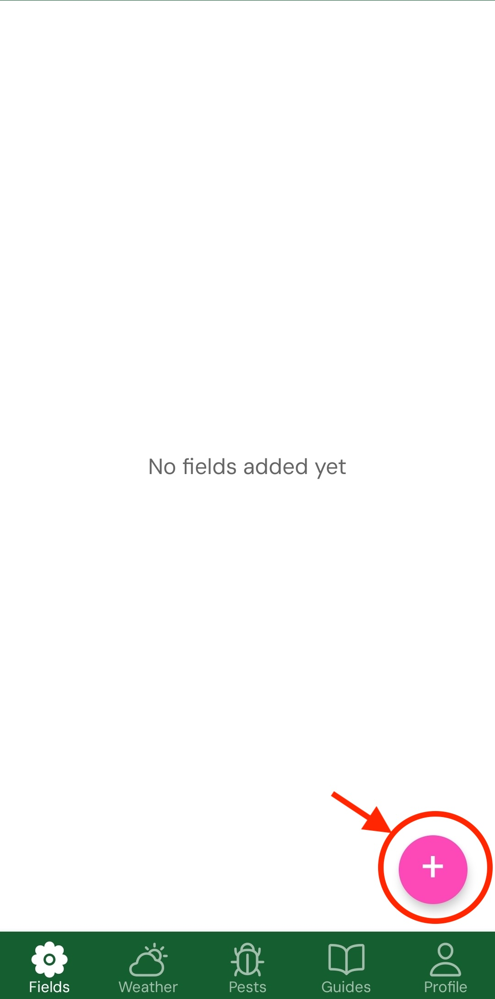
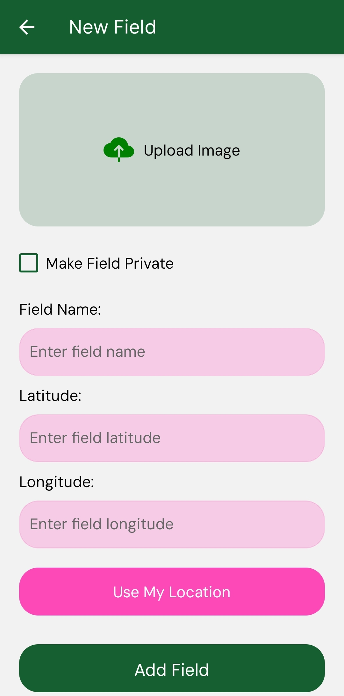
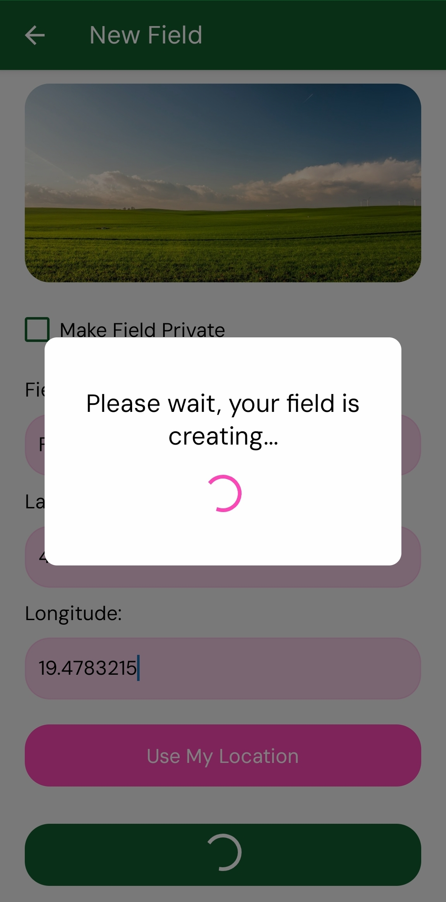
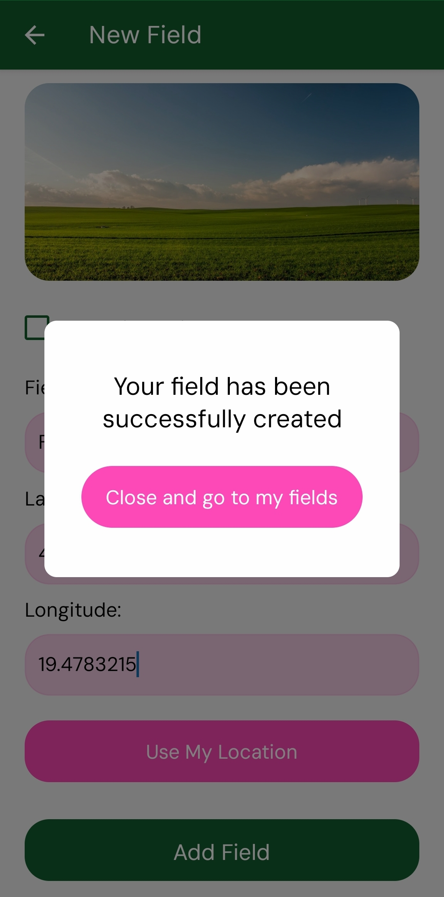
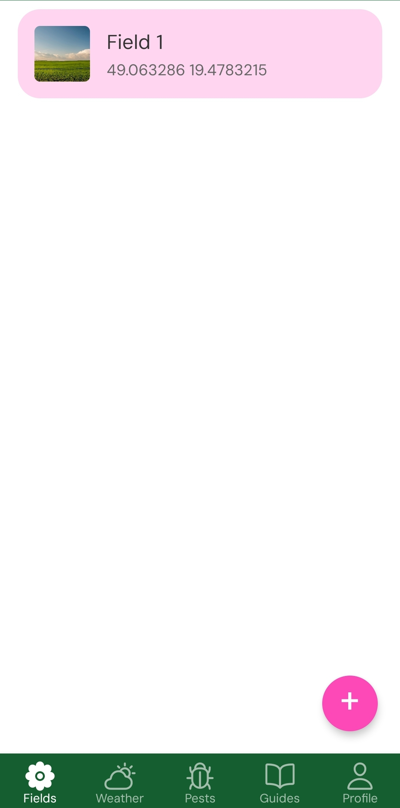

# Creating your first field 🚜

Once you are logged in, you will see your fields as the first screen once you enter the application.

To add a new field click on "+" icon.



Once clicked, you will be prompted to enter field name, image and location of the field. You can also select if you want to have field minted privately. 

```NOTICE: If you field is privately minted, you need to set your password for minting first. Noone other than you have this password, so please write it down or make sure to remember it!```



After you clicked create field button (Granted you have enough balance) you will be greeted with "wait please" notification while your Field collection creates.



Once created you can click on get back to field screen and your field should appear in it right away (In some cases it can take a few moments to reappear). 

<div style="display: flex; gap: 40px;">
  
  
</div>