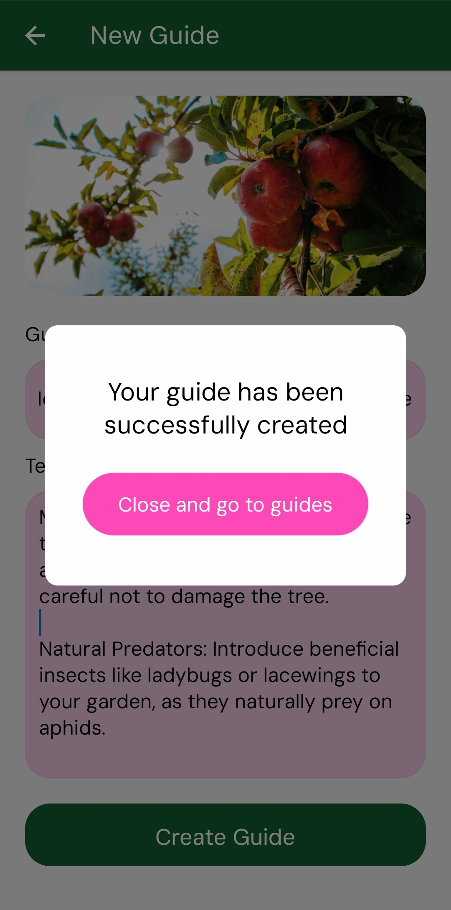

# Creating your first guide 📕

Farmers help farmers. If you wish to contribute to common knowledge you can create useful guides. Farmers that find your guide useful may reward it with like (Of custom sum they wish to use).

Guides are visible to everyone so please only create them with useful information as they are also moderated.

To create a new guide click on the "+" icon.

Enter guide headline, guide description and guide image.

Once you click create guide button you will be prompted with please wait popup.

After the popup finishes you will be prompted to pay fee for creating the guide. The amount you will be required to pay will be displayed in the popup. Please keep in mind, that the sum is 10^-12. So if you see 1 000 000 you will pay 0.0001 of the actual 1 unit of currency.

After you confirm to pay, another please wait popup will follow.

    
    

This time your guide should be created and when you click to redirect back to guides section you can start exploring it.

