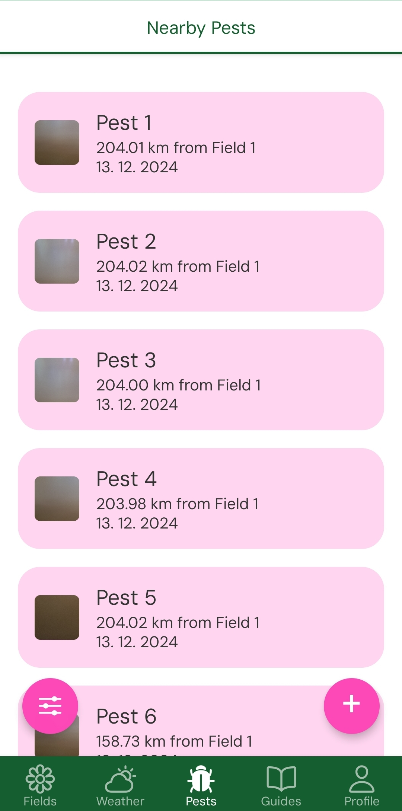
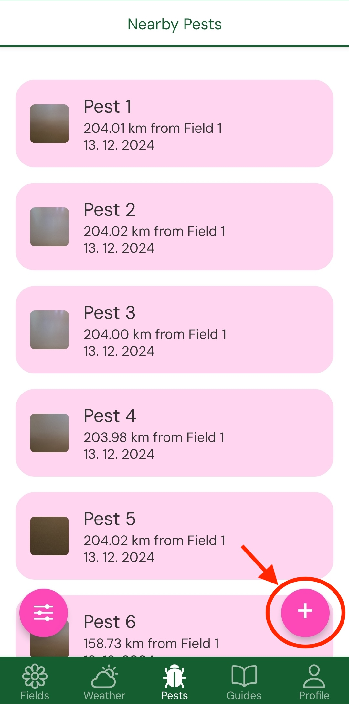

# Creating your first Pest report 🧫

Farmers help farmers. Report Pests that plague your crops. You may help other farmers with fields nearby and if they find your report useful they can reward you by custom donation.

Once you click on pests you may be presented with pests nearby your fields. If there are none nearby, you will see no pests nearby message.



To add new pest click on "+" button.



You will be requested to provide Pest name, pest description and pest image.


Once details are provided and you click on create pest button you will be greeted with please wait popup.


Afterwards you will be prompted to pay for fees associated with pest NFT minting. Please keep in mind, that the sum is 10^-12. So if you see 1 000 000 you will pay 0.0001 of the actual 1 unit of currency. 

```Notice: Pests are strongly encrypted because they contain your location, thus they act as private fields. They are however encrypted by AgriDot secret phrase to prevent you from sending your secret password through servers.```


Once payment was successful you will be greeted by another please wait popup. 

<div style="display: flex; gap: 40px;">
    
    
</div>

After it finishes you will see a button to return back to pests.


You should see your pests now nearby your fields along with other pests created by other farmers that are nearby.