# Feeling generous? 💰

Your donation matters. Help incentivize other farmers to post more useful guides or pest reports.

There are two ways you can donate to other farmers.

**First way is to donate to a farmer that created good guide:**

- 1. Navigate to guides section
- 2. Navigate to guide of choice
- 3. Click on like button
- 4. Insert the support amount
- 5. Confirm donation

    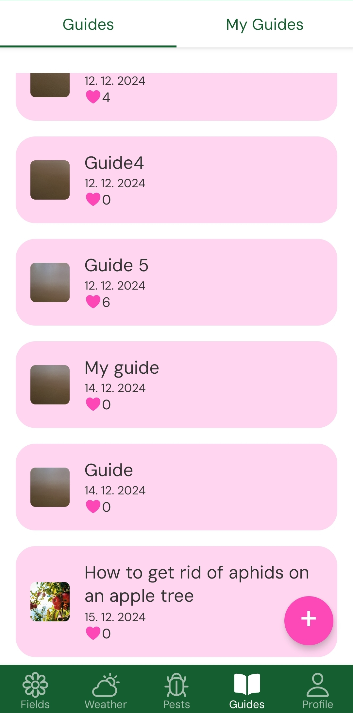
    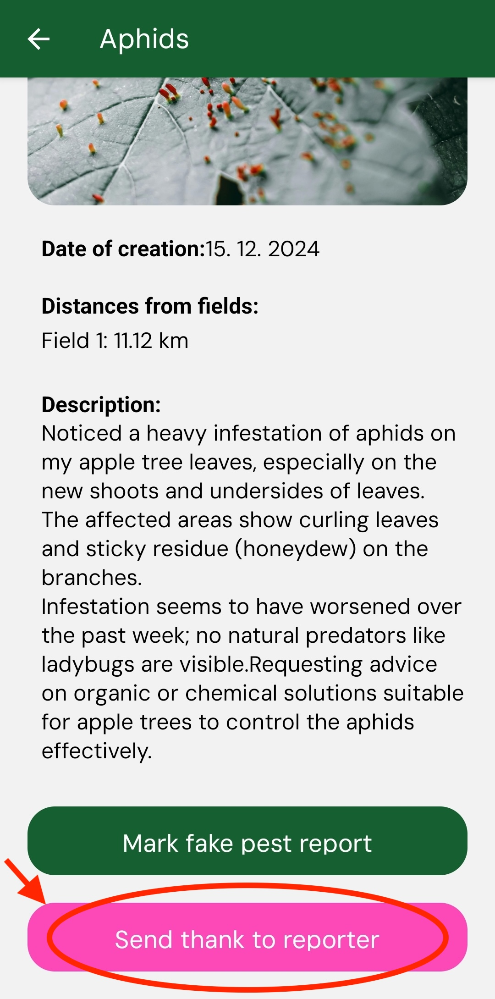
    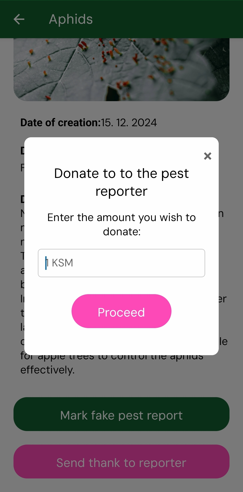
    
    

**The second option of supporting other farmers is through supporting pest reporters**

- 1. Navigate to pests section
- 2. Navigate to pest of choice
- 3. Click on support button
- 4. Insert the support amount
- 5. Confirm donation

    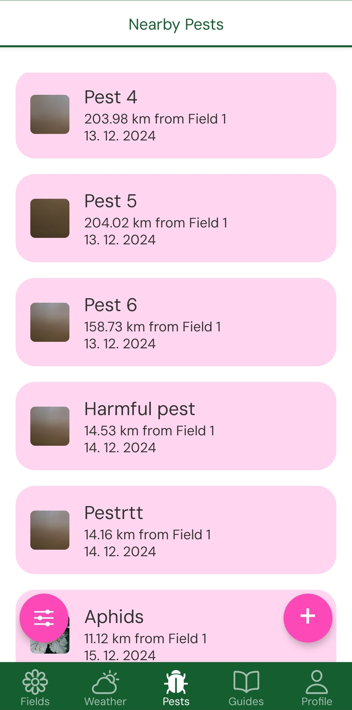
    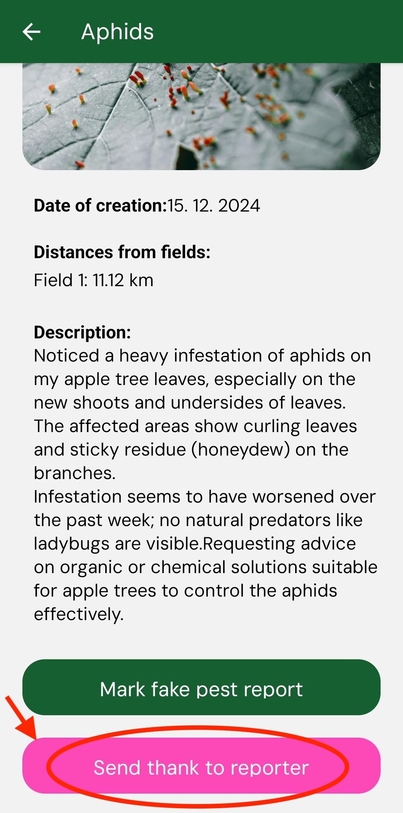
    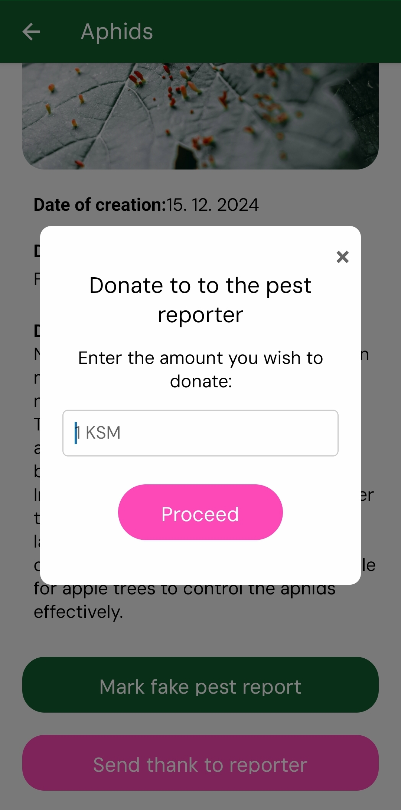
    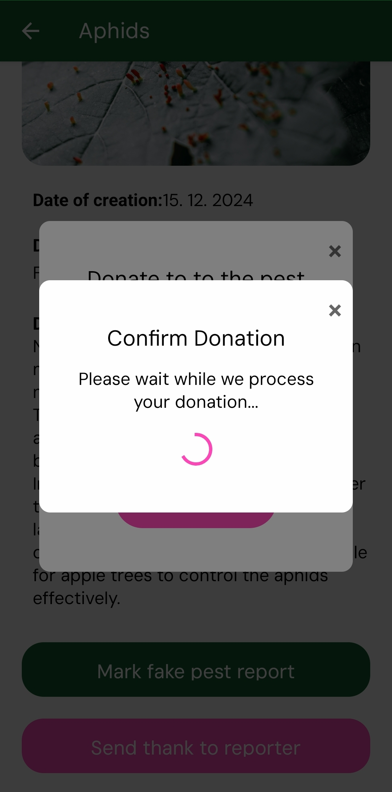
    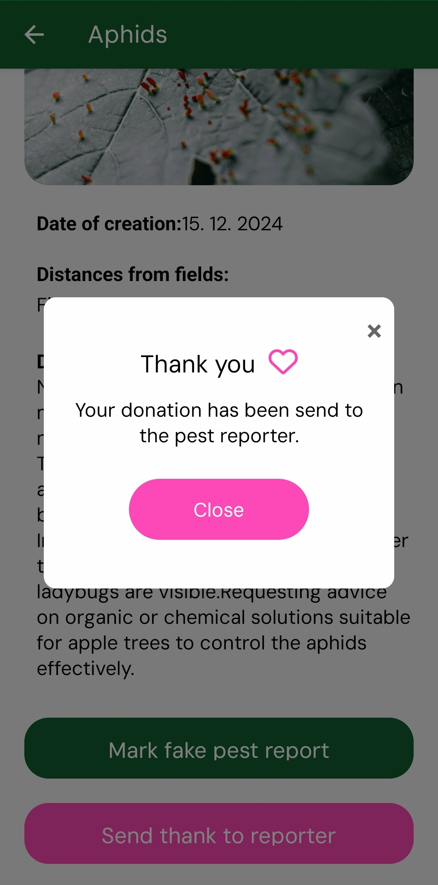

**Supporting AgriDot team**

We appreciate if you decide to support our team. We do not have any plans on monetizing the platform and we want it to be purely common good for every farmer. So BIG ❤️felt THANKS from us! 

- 1. Navigate to profile section
- 2. Click on donate button
- 3. Insert the donation amount
- 4. Confirm donation

    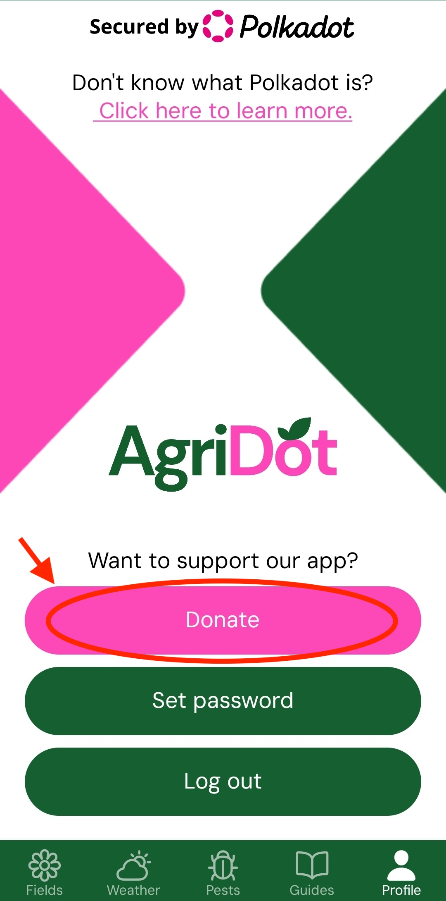
    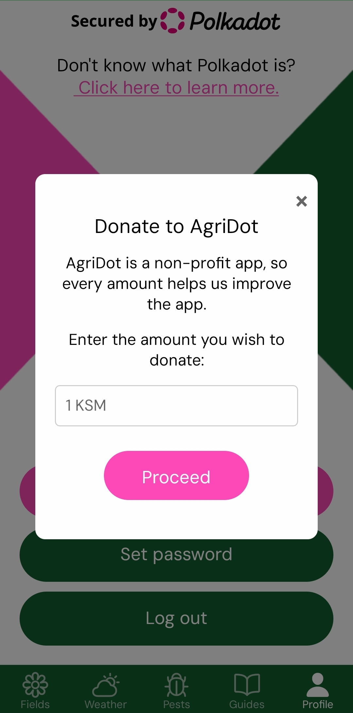
    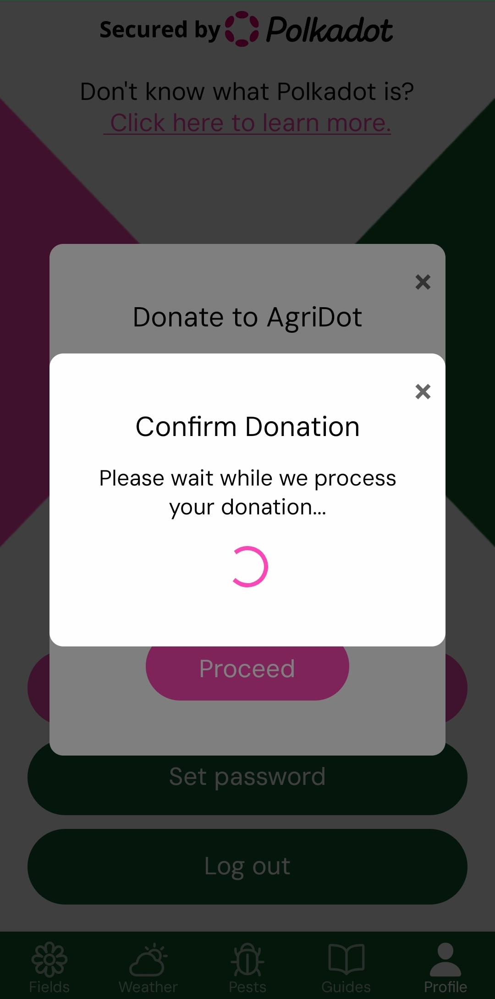
    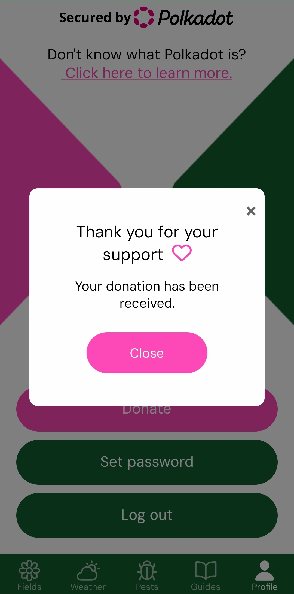

