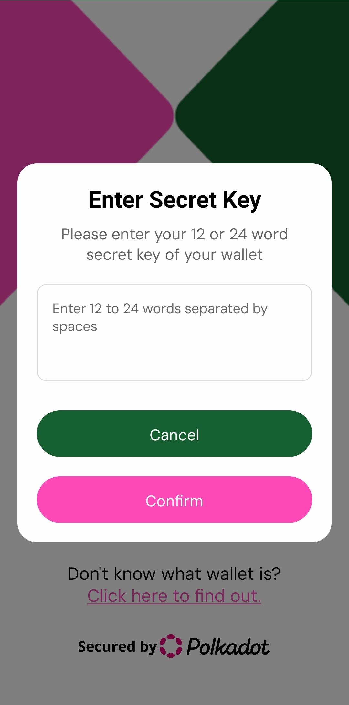
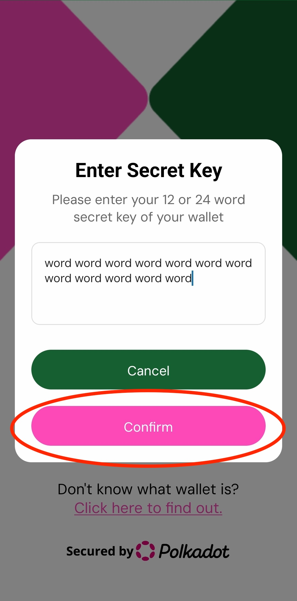

# How to sign in into AgriDot? 🗝️

AgriDot doesn't use any databases or anything to hold user information. You can sign in with your mnemonic 12 or 24 word phrase. This phrase is securely stored on the device and never sent anywhere.

Once you launch AgriDot you will be greeted with welcome screen.

You can click on connect wallet which will prompt you to enter 12 or 24 word mnemonic phrase.

Once entered you can click on confirm which will greet you to welcome screen.

You can now start using the application.